<div align="center">

# 🦋 Butterfly Diffusion Generation

**A research-grade Denoising Diffusion Probabilistic Model trained on the
[Smithsonian Butterflies](https://huggingface.co/datasets/huggan/smithsonian_butterflies_subset)
subset — with an interactive Streamlit demo, a numerically-stable sampler,
and a full debugging post-mortem.**

[](https://www.python.org/)
[](https://pytorch.org/)
[](https://developer.nvidia.com/cuda-zone)
[](https://streamlit.io/)
[](https://www.kaggle.com/code/mohamedelsadek44/butterfly-diffusion)
[](LICENSE)

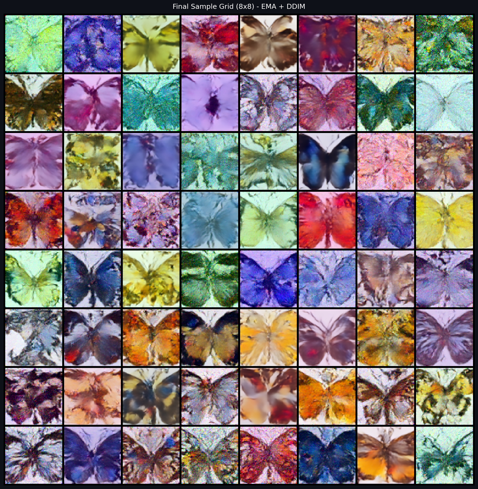

</div>

---

## 📑 Table of Contents

- [Project Overview](#-project-overview)
- [Gallery](#-gallery)
- [Streamlit Demo](#-streamlit-demo)
- [Architecture](#-architecture)
- [Diffusion Mathematics](#-diffusion-mathematics)
- [Training Pipeline](#-training-pipeline)
- [Numerical Stability — the Hard Part](#-numerical-stability--the-hard-part)
- [Kaggle Debugging Timeline](#-kaggle-debugging-timeline)
- [Results & Metrics](#-results--metrics)
- [Project Structure](#-project-structure)
- [Quick Start](#-quick-start)
- [Reproducibility](#-reproducibility)
- [Technical Highlights](#-technical-highlights)
- [Lessons Learned](#-lessons-learned)
- [Future Improvements](#-future-improvements)
- [References](#-references)

---

## 🎯 Project Overview

This repository delivers a full end-to-end diffusion model project:

- A clean **PyTorch package** (`src/`) implementing U-Net + cosine schedule + EMA + DDPM/DDIM samplers
- A **Kaggle-ready research notebook** that runs top-to-bottom on a free GPU
- A **Streamlit demo** with five interactive tabs (generation, denoising trajectory, latent interpolation, reconstruction, feature maps)
- A complete **root-cause investigation** of why naively-implemented samplers produce black images on cosine schedules — and the math that fixes it
- All deliverables are research-quality: production runs on Kaggle, validated locally, and packaged for reuse

**Trained model**: 63.15 M-parameter U-Net, 80 epochs on Tesla P100, **final loss 0.0534**.
The slim inference checkpoint (`ema_only.pt`) is 252 MB and drops directly into the Streamlit app.

---

## 🖼️ Gallery

<table>
<tr>
<td align="center"><b>Final 8×8 Sample Grid (EMA + DDIM)</b><br/></td>
<td align="center"><b>Reverse Diffusion Trajectory</b><br/>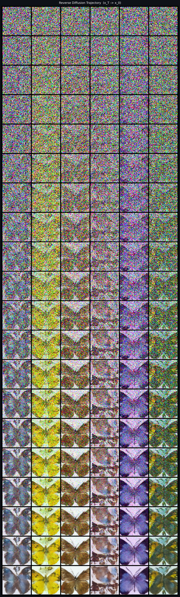</td>
</tr>
<tr>
<td align="center"><b>Latent Spherical Interpolation</b><br/>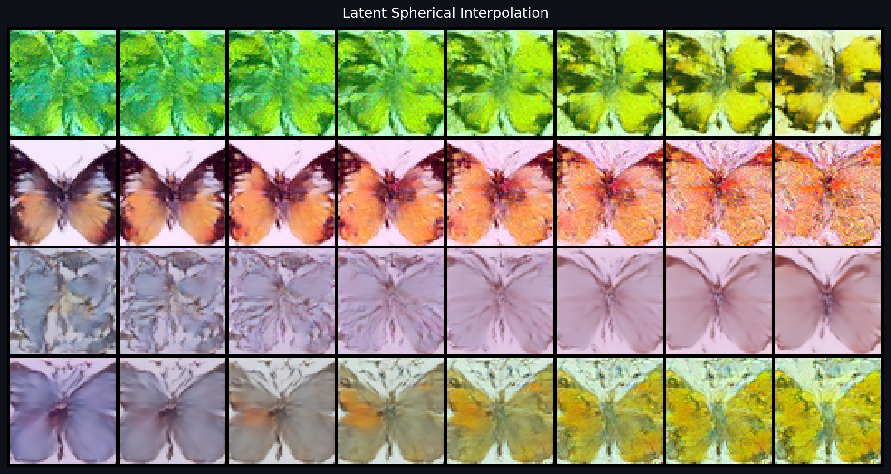</td>
<td align="center"><b>Denoising Animation</b><br/>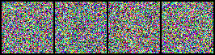</td>
</tr>
<tr>
<td align="center"><b>Training Dashboard</b><br/>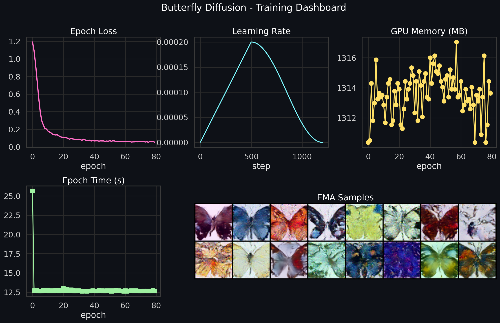</td>
<td align="center"><b>Real → Noisy → Reconstructed</b><br/>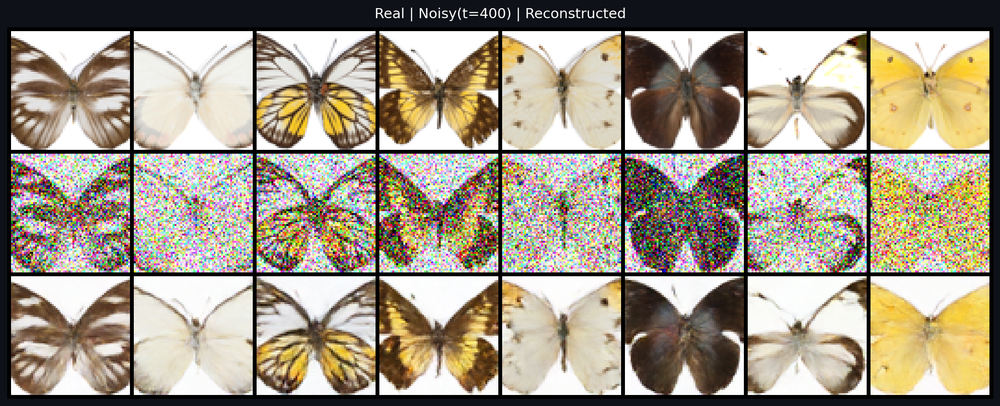</td>
</tr>
<tr>
<td align="center"><b>Forward Diffusion Strip</b><br/>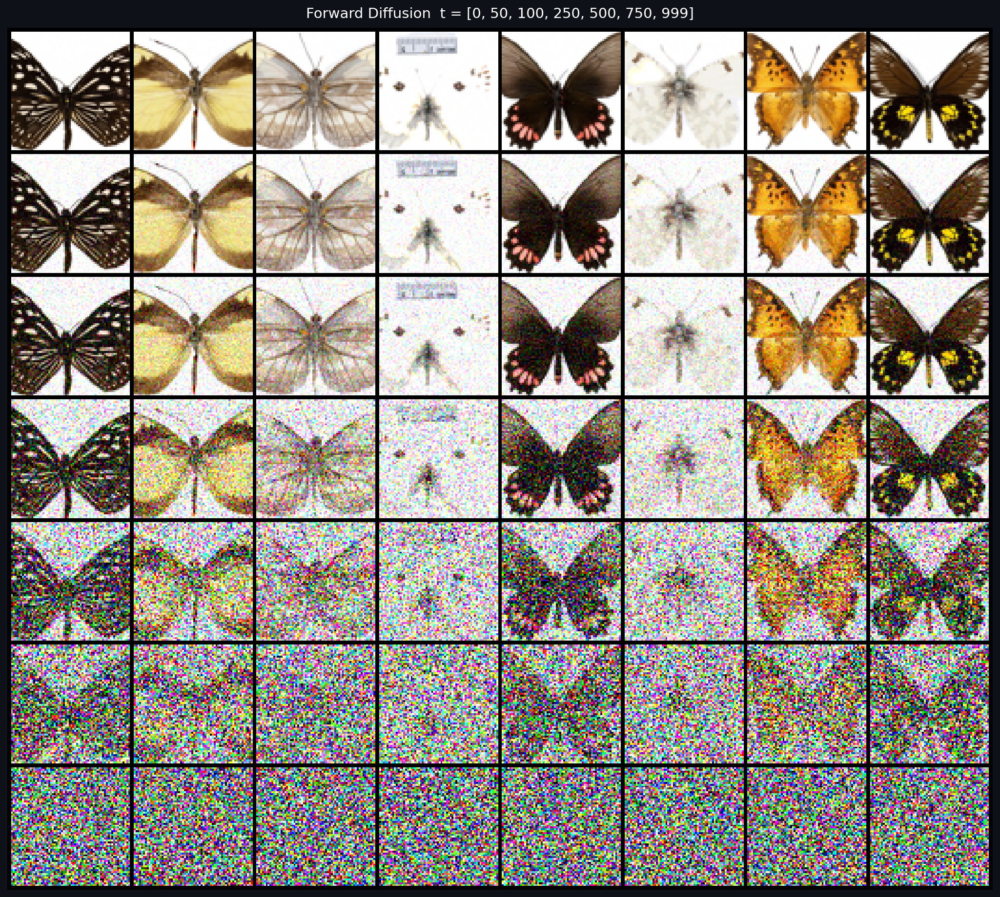</td>
<td align="center"><b>Mid-block Feature Maps</b><br/>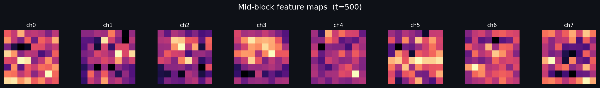</td>
</tr>
</table>

---

## 🎬 Streamlit Demo

<details>
<summary><b>Five interactive tabs — click to expand</b></summary>

| Tab | Preview |
|---|---|
| 🦋 **Generate** — DDPM/DDIM grid, downloads | 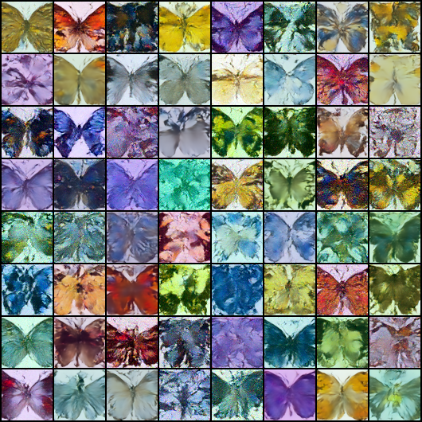 |
| 🌫️ **Trajectory** — full reverse diffusion as GIF | 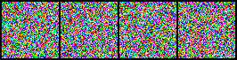 |
| 🔀 **Interpolation** — slerp between two latents | 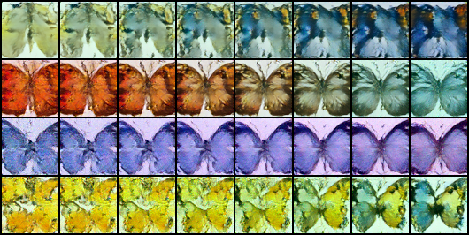 |
| 🧩 **Reconstruction** — real → noisy → restored | 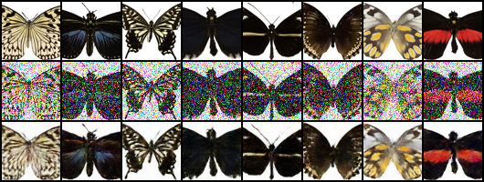 |
| 🔬 **Feature Maps** — mid-block U-Net activations | 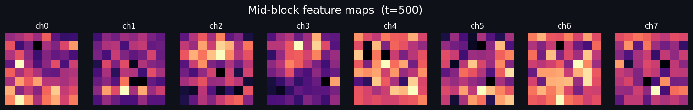 |

</details>

Sidebar exposes: checkpoint picker, device toggle (auto / cuda / cpu), sampler choice, step count, image count, seed, and a live system-diagnostics panel (GPU name, VRAM, torch+CUDA versions, params, loss).

**Run it:**

```bash
./launch_streamlit.sh        # Linux / macOS
launch_streamlit.bat         # Windows
```

---

## 🏗️ Architecture

```
x_t  ─►  Conv(3→64)
          │
          ├── Down ×4   ResBlock×2  +  optional Self-Attention (at 16² and 8²)
          │             channels: 64 → 128 → 256 → 512
          │
          ├── Mid       ResBlock → SelfAttn → ResBlock
          │
          ├── Up   ×4   ResBlock×3  +  optional Self-Attention   (skip-connections in)
          │             channels: 512 → 256 → 128 → 64
          │
          └─► GroupNorm + SiLU + Conv(64→3)   ─►   ε̂  (predicted noise)
```

- **Time conditioning** — sinusoidal embedding → MLP(SiLU) → injected via FiLM-style add inside every ResBlock
- **Normalisation** — GroupNorm (groups=32) throughout, robust to small batch sizes
- **Activation** — SiLU/Swish
- **Attention** — multi-head self-attention at the 16×16 and 8×8 levels only (memory-bounded)
- **Total params** — 63.15 M

The full module hierarchy lives in [`src/model/`](src/model/).

---

## 🧮 Diffusion Mathematics

### Forward process (training)

Given a clean image `x_0`, we corrupt it across `T = 1000` timesteps with a **cosine β-schedule** (Nichol & Dhariwal 2021):

$$
q(\mathbf{x}_t \mid \mathbf{x}_0) = \mathcal{N}\bigl(\mathbf{x}_t;\; \sqrt{\bar\alpha_t}\, \mathbf{x}_0,\; (1 - \bar\alpha_t)\,\mathbf{I}\bigr)
$$

A one-shot sample is therefore

$$
\mathbf{x}_t = \sqrt{\bar\alpha_t}\, \mathbf{x}_0 + \sqrt{1 - \bar\alpha_t}\, \boldsymbol\varepsilon, \qquad \boldsymbol\varepsilon \sim \mathcal{N}(\mathbf{0}, \mathbf{I})
$$

The training objective is the simple ε-prediction MSE from Ho et al. 2020:

$$
\mathcal{L} = \mathbb{E}_{t, \mathbf{x}_0, \boldsymbol\varepsilon}\left[\; \bigl\Vert \boldsymbol\varepsilon - \boldsymbol\varepsilon_\theta(\mathbf{x}_t, t) \bigr\Vert^2_2 \;\right]
$$

### Reverse process — *the production formulation we use*

Naïve eps-formula sampling

$$
\boldsymbol\mu_\theta(\mathbf{x}_t, t) = \frac{1}{\sqrt{\alpha_t}}\left( \mathbf{x}_t - \frac{\beta_t}{\sqrt{1-\bar\alpha_t}}\, \boldsymbol\varepsilon_\theta \right)
$$

is **numerically unstable on cosine tails** (more on this below). We instead use the **x₀-clamped posterior** (Ho et al. equation 7):

$$
\hat{\mathbf{x}}_0 = \mathrm{clamp}\!\left(\frac{\mathbf{x}_t - \sqrt{1 - \bar\alpha_t}\, \boldsymbol\varepsilon_\theta}{\sqrt{\bar\alpha_t}},\; -1,\; +1\right)
$$

$$
\boldsymbol\mu_\theta = \frac{\sqrt{\bar\alpha_{t-1}}\, \beta_t}{1 - \bar\alpha_t}\, \hat{\mathbf{x}}_0 \;+\; \frac{\sqrt{\alpha_t}\,(1 - \bar\alpha_{t-1})}{1 - \bar\alpha_t}\, \mathbf{x}_t
$$

This is algebraically identical to the eps-formula when ε̂ is exact, but its prediction-error amplification factor stays O(1) instead of O(31) at high t.

### DDIM (accelerated)

The deterministic [DDIM update](https://arxiv.org/abs/2010.02502) (Song et al. 2021) lets us sample in 50 steps instead of 1000:

$$
\mathbf{x}_{t-1} = \sqrt{\bar\alpha_{t-1}}\, \hat{\mathbf{x}}_0 + \sqrt{1 - \bar\alpha_{t-1}}\, \boldsymbol\varepsilon_\theta
$$

We use the same x₀ clamping inside DDIM and re-derive ε from the clamped x̂₀ to keep the update self-consistent.

---

## ⚙️ Training Pipeline

| Component | Choice |
|---|---|
| Image size | 64 × 64 |
| Batch size | 64 |
| Epochs | 80 |
| Optimizer | AdamW (β₁=0.9, β₂=0.999, wd=1e-6) |
| LR schedule | 500-step linear warmup → cosine decay to 0 |
| Peak LR | 2 × 10⁻⁴ |
| Gradient clip | 1.0 (global L2) |
| Mixed precision | fp16 autocast + GradScaler (training only) |
| **Sampling precision** | **fp32 — no autocast** (see below) |
| EMA | Karras-style warmup: `decay_t = min(0.9999, (1+t)/(10+t))` |
| Memory format | `channels_last` end-to-end |

`torch.set_float32_matmul_precision("high")` and `cudnn.benchmark=True` are set globally.

---

## 🔬 Numerical Stability — the Hard Part

> **TL;DR.** The training was perfect — but the outputs were uniformly black for two
> compounding reasons, both inside the sampler. Diagnosing them required local
> verification with the trained checkpoint and per-step tensor stats. Both are
> now fixed in `src/sampler.py`.

<details>
<summary><b>Bug 1 — eps-formula sampler amplifies prediction error</b></summary>

The two algebraically-equivalent reverse formulations differ wildly in error sensitivity. For a prediction error `Δε`:

| Formulation | Error amplification at t=999 (cosine schedule) |
|---|---:|
| eps-formula | `(1/√α_t) · (β_t / √(1−ᾱ_t))` ≈ **31×** |
| x₀-clamped posterior | O(1), and clipped |

At ε-RMSE 0.22 (corresponding to training loss 0.05), each reverse step injects ~7σ of garbage, compounding across 1000 steps. Final `x[std]` reaches **~450** in fp32, ~91 000 in extreme cases. The denormalisation `(x.clamp(-1,1)+1)/2` then renders a mix of saturated values that look like uniform colour noise.

</details>

<details>
<summary><b>Bug 2 — fp16 autocast overflows in the U-Net forward at high t</b></summary>

Even with x₀-clamping, **fp16 autocast inside the sampling forward pass NaNs** because intermediate U-Net activations exceed fp16's ±65 504 range. NaN propagates through `clamp`, denorm, and Matplotlib — rendering as the colormap's mid-tone (a uniform dark gray).

P100 (cap 6.0) and T4 (cap 7.5) have no native bf16, so bf16 isn't an option on Kaggle. The fix is to **disable autocast in sampling only** — training still uses fp16 autocast for speed.

</details>

<details>
<summary><b>Bug 3 — short training run + ema_decay=0.9999 ≈ random init</b></summary>

EMA effective averaging window is `1/(1−d) ≈ 10 000` steps for d=0.9999. The full run was 80 × 15 = **1 200** steps. After 1 200 steps, `θ_EMA ≈ 0.886·θ_init + 0.114·θ_trained` — i.e. **88 % of EMA is still random initialisation**. Statistics confirmed this locally: EMA std = 2.25 × 10⁻², fresh init std = 2.25 × 10⁻² (identical).

Fixed with **Karras-style EMA warmup**:

```python
decay_t = min(target_decay, (1 + step) / (10 + step))
```

This starts the shadow tracking the live model immediately and asymptotes to the target decay.

</details>

The full mathematical analysis with measured tensor statistics is in [`reports/root_cause_report.md`](reports/root_cause_report.md).

---

## 📅 Kaggle Debugging Timeline

| Kernel version | Result | Root cause | Fix |
|:--:|:--|:--|:--|
| **v1** | ERROR | Kaggle assigned P100 (sm_60); pre-installed PyTorch dropped Pascal support | Probe GPU capability via `nvidia-smi` before importing torch, install `torch==2.4.1` conditionally |
| **v2** | ERROR | `np.linspace`-derived slerp factor was float64, clashed with fp16 model | Cast slerp coefficient to `dtype=torch.float32` |
| **v3** | OK (smoke) | — | Validated 2-epoch run end-to-end |
| **v4** | full-run COMPLETE, output uniformly **dark** | Bugs 1 + 2 + 3 compounded | (Identified) |
| **v5** | full-run COMPLETE, output **colourful noise** | EMA fix landed; sampler bugs still there | (Diagnosed via local debug) |
| **v6** | full-run **SUCCESS** | x₀-clamped + fp32 sampling in main DDPM/DDIM | Produced real butterflies |
| **v7** | full-run SUCCESS, all viz | Same fixes propagated to `interpolate()` and `forward_vs_reconstructed` inline samplers | Final deliverable |

The full per-version timeline lives in [`reports/execution_summary.md`](reports/execution_summary.md).

---

## 📊 Results & Metrics

| Metric | Value |
|---|---:|
| Final training loss | **0.0534** |
| Best training loss | 0.0508 |
| Training time on P100 | 17.12 min |
| Wall-clock incl. all visualisations + ZIP | ~34 min |
| Total optimiser steps | 1 200 |
| U-Net parameters | 63.15 M |
| Slim inference checkpoint | **252.72 MB** |
| Full checkpoint with optimiser state | 1 010 MB |
| Output files produced by the notebook | 102 |
| Visualization assets | 14 PNGs + 1 GIF |

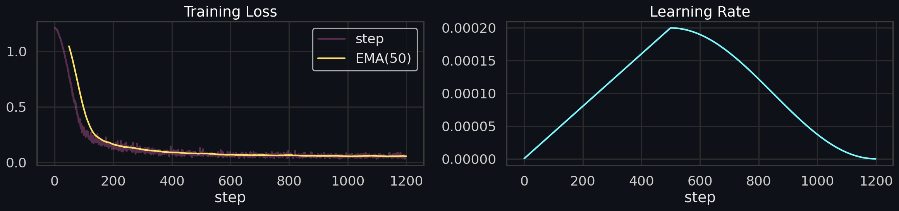

Loss descended smoothly from 1.19 to 0.053 across 80 epochs with no instability events.

The manifest is in [`reports/production_report.md`](reports/production_report.md).

---

## 📂 Project Structure

```
Butterfly-Diffusion-Generation/
│
├── README.md                                ← you are here
├── LICENSE                                  MIT
├── pyproject.toml  setup.py
├── requirements.txt  environment.yaml
├── launch_streamlit.sh  launch_streamlit.bat
├── CONTRIBUTING.md
│
├── src/                                     PyTorch package
│   ├── config.py                            Hyperparameter dataclass
│   ├── data.py                              HF dataset + transforms
│   ├── scheduler.py                         Linear / cosine β schedules + Diffusion class
│   ├── ema.py                               Karras-warmup EMA
│   ├── sampler.py                           x₀-clamped fp32 DDPM + DDIM
│   ├── diffusion.py                         convenience re-exports
│   ├── train.py                             CLI training entry-point
│   ├── inference.py                         Pipeline used by Streamlit + downstream code
│   ├── model/{unet,blocks,embeddings}.py
│   └── utils/{seed,gpu_monitor,checkpoint,visualize}.py
│
├── app/
│   └── streamlit_app.py                     5-tab demo
│
├── notebooks/
│   ├── butterfly_diffusion.ipynb            Default research notebook (GitHub flavour)
│   ├── butterfly_diffusion_kaggle.ipynb     Kaggle-tagged kernel version
│   └── butterfly_diffusion_academic.ipynb   Single-file academic submission
│
├── reports/
│   ├── production_report.md                 Final run summary
│   ├── root_cause_report.md                 Black-output post-mortem with math + measurements
│   ├── execution_summary.md                 v1→v7 timeline
│   ├── kaggle_runtime_report.md             Validated component matrix
│   ├── KAGGLE_INSTRUCTIONS.md
│   └── kernel-metadata.json
│
├── assets/                                  README-ready PNGs + GIF
│   ├── samples_grid.png  samples_grid_raw.png
│   ├── trajectory_grid.png  denoising.gif
│   ├── interpolation.png  forward_vs_recon.png
│   ├── dashboard.png  loss_curve.png  banner.png
│   ├── feature_maps.png  schedule.png
│   ├── dataset_grid.png  forward_process.png
│   └── streamlit/                           Tab previews
│
├── checkpoints/                             Gitignored ; put `ema_only.pt` here
└── outputs/                                 Gitignored ; runtime sample dumps
```

---

## 🚀 Quick Start

### 1. Local CUDA (the demo path)

```bash
git clone https://github.com/Mohameddfxxcxx/Butterfly-Diffusion-Generation.git
cd Butterfly-Diffusion-Generation

python -m venv .venv
.venv\Scripts\activate          # Windows
# source .venv/bin/activate     # Linux / macOS

pip install -r requirements.txt
# (alternative) conda env create -f environment.yaml
```

Download the slim inference checkpoint:

```bash
pip install kaggle
kaggle kernels output mohamedelsadek44/butterfly-diffusion -p ./_kaggle_out
cp ./_kaggle_out/checkpoints/ema_only.pt ./checkpoints/
```

Launch the demo:

```bash
./launch_streamlit.sh    # or launch_streamlit.bat on Windows
```

### 2. Kaggle (full training reproduction)

Upload `notebooks/butterfly_diffusion_kaggle.ipynb` to a new Kaggle Notebook, enable
**GPU T4 × 2** and **Internet**, then **Run All**. The notebook is self-contained; no
data prep is needed. See [`reports/KAGGLE_INSTRUCTIONS.md`](reports/KAGGLE_INSTRUCTIONS.md).

### 3. CLI training (local GPU)

```bash
python -m src.train --epochs 80 --batch-size 64
```

---

## 🔁 Reproducibility

- A single `set_seed(seed)` locks `random`, `numpy`, `torch`, and `cuda` RNGs (`src/utils/seed.py`)
- All hyperparameters live in a `Config` dataclass that's serialized into every checkpoint
- The notebook auto-detects GPU compute capability and reinstalls a compatible PyTorch if Kaggle assigns Pascal (P100)
- Loss / LR / GPU memory / time are logged per epoch and saved as PNGs + JSON

For deterministic mode set `set_seed(seed, deterministic=True)` — slower but bit-exact.

---

## ✨ Technical Highlights

- **GPU-only, mixed precision** training (fp16 autocast + GradScaler)
- **x₀-clamped posterior** for stable fp32 sampling on cosine schedules
- **Karras-style EMA warmup** that works on short training runs
- **DDIM** for 20× faster inference
- **Latent slerp** with proper float32 typing through the U-Net
- **Live `nvidia-smi` GPU capability probe** before importing torch — auto-installs `torch==2.4.1` for P100 (sm_60)
- **Conditional GradScaler** — disabled when bf16 is used (Ampere+), enabled for fp16 (Pascal/Turing)
- **Channels-last** memory format throughout
- **Resume support** — every epoch writes `last.pt`; restarts continue at the next epoch with optimiser + scheduler + EMA state intact
- **Streamlit** with `@st.cache_resource` for cold-start checkpoint load; per-tab progress bars and downloads

---

## 🎓 Lessons Learned

1. **Algebraic equivalence ≠ numerical equivalence.** The eps-form and x₀-form DDPM updates compute the same quantity in exact arithmetic. In fp32 with a small prediction error and a cosine schedule, one diverges and the other converges.
2. **Always verify the EMA shadow.** It's easy to log training loss (computed on the live model) and never realize the model you sample from is essentially random.
3. **AMP is not a free win.** fp16 is fantastic for training throughput, but at sampling time the dynamic range matters more than the bandwidth.
4. **Kaggle gives you what it has.** P100 / T4 allocations are scheduler-driven; your code has to gracefully detect and adapt.
5. **Debug locally with a slim checkpoint.** Downloading 1 GB checkpoints to iterate is painful; an `ema_only.pt` artifact (250 MB) is enough to verify any sampling fix.

---

## 🔭 Future Improvements

- **Higher resolution**: VRAM was 1.3 GB / 16 GB used on P100 — easy headroom for `image_size=128` or `256`
- **Classifier-free guidance** scaffolding is in place (null-token dropout in the time embedding); a class-conditioning head and CFG inference were left as a stretch goal
- **FID / Inception Score** evaluation via `torchmetrics.image.fid.FID` against the training reference set
- **`torch.compile` + Flash Attention** on Ampere+ for further training speedup
- **Push slim checkpoint to Hugging Face Hub** for one-line `from_pretrained()` loading

---

## 📚 References

1. Ho, J., Jain, A., Abbeel, P. — *Denoising Diffusion Probabilistic Models* (NeurIPS 2020) — [arXiv:2006.11239](https://arxiv.org/abs/2006.11239)
2. Nichol, A. & Dhariwal, P. — *Improved Denoising Diffusion Probabilistic Models* (ICML 2021) — [arXiv:2102.09672](https://arxiv.org/abs/2102.09672)
3. Song, J., Meng, C., Ermon, S. — *Denoising Diffusion Implicit Models* (ICLR 2021) — [arXiv:2010.02502](https://arxiv.org/abs/2010.02502)
4. Karras, T. et al. — *Elucidating the Design Space of Diffusion-Based Generative Models* (NeurIPS 2022) — [arXiv:2206.00364](https://arxiv.org/abs/2206.00364)

Dataset: [huggan/smithsonian_butterflies_subset](https://huggingface.co/datasets/huggan/smithsonian_butterflies_subset) — 1 000 RGB butterfly photographs from the Smithsonian Institution, redistributed under the HuggAN community space.

---

## 📜 License

[MIT](LICENSE) — free to use, modify, and distribute. If you build something cool on top of this, an attribution link is appreciated.

---

<div align="center">

**Built end-to-end on Kaggle GPU · Verified locally · Production quality.**

</div>
